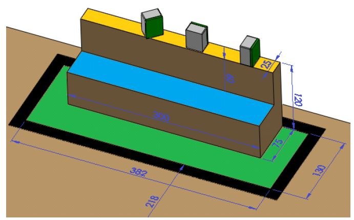
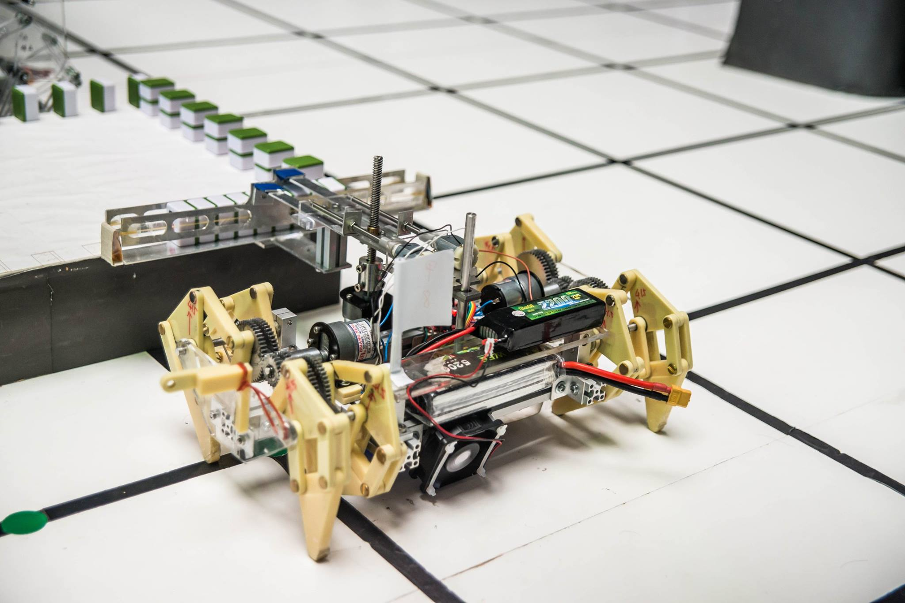

# Mechanical Engineering Project
NCKU ME Mechanical Engineering Project (105-2)

## Callenges

We have to design and make a robot to move targets to desired positions.
The robot can be controlled automatically or manually.
Only autocatically controlled robots are allowed to use wheels.
The competetion area is shown in the following.

Targets were placed on a square platform.

There are some fixed and moving obstacles.

We would get different scores for putting targets to different positions.

The major goal was to get high score within limited time.
Also, we have to avoid drop targets on the ground, every dropping would lose points.

## Our Design

1. Main structure:
    Aluminum extrusion (It is strong and easy to assemble, adjust, and screw something on it) (We used saw to cut them into proper length and used milling machine to get precise length)
1. Foot mechanism:
    Theo Jansen's foot design.
    (We used engraving machine to cut ABS to bulid basic components (stiffness is better than PMMA) and used screw posts as joint.)
    (We used wire EDM to cut aluminume gear, which transmit power from motor to foot mechanism.)
    
1. Lifting and clamping mechanism:
    Vertical screw to lift (It can move smoothly and has large lift force) and two parallel plates to clamp
    (We use milling machine and wire EDM to cut thin alluminum plates, which have good stiffness and are light)
    
1. Power source:
    Lipo battery
1. Control system:
    Arduino mega, L293D

### Some photos of our robots

## Control pannel

We built a quick prototype by [MIT APP Inventor](http://appinventor.mit.edu/explore/).

We used mobile app as controller to send signal to arduino and control the motors.

Our arduino codes are in *source* folder.

## Prizes we got

We won serveral prizes in the course: 校長特別獎、光陽公司特別獎、福特公司特別獎

You can find the certificates [here](figures/prizes.pdf) (email us to access)

precipitation25@gmail.com
